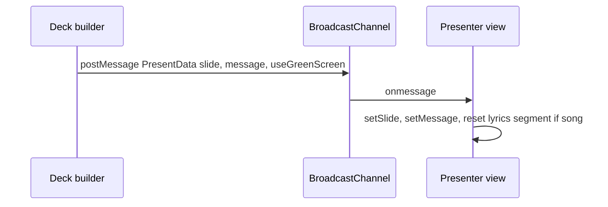
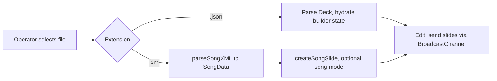
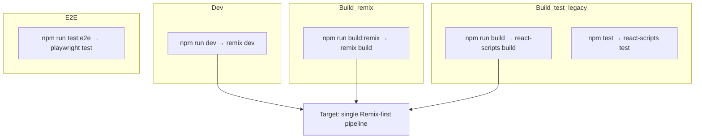

# ADR 0001: Tech stack and runtime workflows

| Field | Value |
| --- | --- |
| **Status** | Accepted (with noted migrations in progress) |
| **Date** | 2026-04-11 |
| **Supersedes** | — |

## Context

Poster needs a **web** **graphics** **stack** that supports:

- Two **surfaces** (**operator** **deck** **builder** and **program** **presenter**) staying in **sync** during **live** **shows**.
- **Professional** **video** **workflows** (keyed **output**, **stable** **layout**) without mandating a **native** **app** or **cloud** **account** for the **core** **loop**.
- **File-based** **authoring** (**JSON** **decks**, **XML** **songs**) with a **planned** **local** **SQLite** **library** for **reuse** and **assets**.

We must document **which** **technologies** **carry** **those** **requirements** and **how** **runtime** **pieces** **sequence** **work** (operator **actions**, **browser** **APIs**, **server** **role**).

## Decision

1. **UI** — **React** **18** with **TypeScript** for **components**, **state**, and **shared** **types** (**`Deck`**, **`Slide`**, **`PresentData`**, **`SongData`**).
2. **Routing / SSR path** — **Remix** (**v1** **line**) with **`app/`** **routes** that **re-export** **builder** and **presenter** from **`src/`** during **migration**; **`remix`** **`dev`** is the **primary** **local** **server** **entry** in **`package.json`**.
3. **Legacy SPA path** — **Create** **React** **App** (**`react-scripts`**) remains for **`build`** / **`test`** (**Jest**, **RTL**) until **Remix** **parity** **retires** or **isolates** **that** **path**.
4. **HTTP server** — **Express** **`server/index.js`** serves **static** **assets**, **loads** **`@remix-run/node`** **`createRequestHandler`** when **available**, and **falls** **back** to **static** **SPA** **behavior** if **Remix** **build** **is** **missing**.
5. **Live sync** — **`BroadcastChannel`** (**name:** **`presentation`**) for **same-origin** **operator** ↔ **presenter** **messaging**; **no** **dedicated** **slide** **server** for **current** **program** **state**.
6. **E2E** — **Playwright** for **browser** **tests** across **routes** and **channels**.
7. **Planned persistence** — **SQLite** for **local** **library** (**decks**, **lyrics**, **images**); **implementation** **location** (**server-side** vs **WASM**) **TBD** — see [poster design guide](../poster-design-guide.md) **Local library (SQLite)**.

## Consequences

### Positive

- **Single** **language** (**TypeScript**) **end-to-end** for **UI** and **shared** **models**.
- **Live** **show** **path** stays **simple**: **two** **tabs** **or** **windows**, **no** **WebSocket** **requirement** for **v1** **sync**.
- **Remix** **positions** us for **loaders/actions**, **file** **uploads**, and **SQLite** **API** **routes** **without** **new** **framework** **choice**.

### Negative / trade-offs

- **Dual** **tooling** (**Remix** + **CRA**) **adds** **cognitive** **load** and **CI** **surface** **until** **consolidated**.
- **`BroadcastChannel`** **does** **not** **cross** **origins** **or** **devices**; **remote** **operator** **needs** **a** **future** **ADR**.
- **Express** **+** **Remix** **handler** **must** **stay** **aligned** with **`remix`** **`build`** **output** **paths**.

## Technology choices (summary)

| Layer | Choice | Role |
| --- | --- | --- |
| Runtime UI | React 18 | Component model, concurrent features as needed |
| Language | TypeScript 4.9.x | Types for deck/slide/present payloads |
| App framework (target) | Remix 1.19.x | Routing, future data APIs, SSR option |
| SPA / test (legacy) | Create React App (`react-scripts` 5) | Production `build` script today; Jest + RTL |
| HTTP | Express | Static files + Remix request handler |
| Client sync | `BroadcastChannel` | Builder ↔ presenter on `presentation` |
| Unit / component tests | Jest + Testing Library | Via CRA test runner |
| E2E | Playwright | Cross-route and broadcast behavior |
| Bundler (Remix dev) | Remix compiler / Vite-related tooling in tree | `vite` present for migration scaffolding |

## Sequences and workflows

### 1. Operator opens builder and presenter (same origin)

```mermaid
sequenceDiagram
  participant Op as Operator browser
  participant BC as BroadcastChannel presentation
  participant Pr as Presenter browser

  Op->>BC: connect(BUILDER), postMessage ping
  Pr->>BC: connect(PRESENTER), postMessage ping
  Note over Op,Pr: Same origin required; channel name presentation
```

### 2. Send full slide to program



### 3. Advance lyrics two lines (partial update)

```mermaid
sequenceDiagram
  participant Builder as Deck builder
  participant BC as BroadcastChannel
  participant Presenter as Presenter view

  Builder->>BC: postMessage PresentData data.lyricsNavigation next|previous|goToVerse
  BC->>Presenter: onmessage
  Presenter->>Presenter: adjust segmentIndex only; keep slide/message
```

### 4. Load deck or song from file (today)



### 5. Development and build workflow



### 6. Planned: library save / open (SQLite)

```mermaid
sequenceDiagram
  participant Builder as Deck builder
  participant API as Remix action / server
  participant DB as SQLite

  Note over Builder,DB: Future; shape TBD per poster-design-guide

  Builder->>API: save deck + asset refs
  API->>DB: INSERT/UPDATE presentations, songs, blobs
  API-->>Builder: ok + id

  Builder->>API: list / open id
  API->>DB: SELECT hydrate
  API-->>Builder: Deck + resolved media
```

## References

- [Poster design guide](../poster-design-guide.md) — product intent, alignment grid, SQLite library goals.
- `package.json` — authoritative dependency versions.
- `remix.config.js`, `server/index.js` — server integration.

## Change log

| Date | Change |
| --- | --- |
| 2026-04-11 | Initial ADR: stack, BroadcastChannel workflows, dev/build sequences, SQLite placeholder. |
