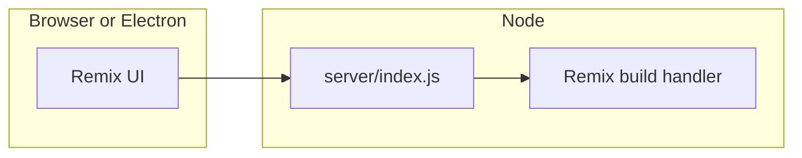

# Epic 002 — Theme, home library, portable zip, Electron, release CI

## Overview

Surface slide **library** actions (list, open, export, delete, backup, restore) on the **main (home) screen**, add **four dark themes** selectable from home, add a **portable zip** produced in CI/CD (per OS), wrap the same stack in an **Electron** app for macOS / Windows / Linux, and add **GitHub Actions**. **Pre-release (PR) and release (merge/tag) both build a native installer per target OS** (not only loose binaries), upload them as workflow artifacts on PRs, and attach them to semver **GitHub Releases** on production release.

## Document control

- **Canonical plan**: `docs/epics/epic-002-theme-install-reorg.plan.md`
- During implementation work in this repo, **prefer updating this file** when the epic scope or decisions change (keep todos in frontmatter in sync).

## Current state (baseline)

- **Home**: `src/HomePage.tsx` (via `app/routes/_index.tsx`) — copy + links to `/deck` and `/presentation` only.
- **Library UI**: `src/Deck/LibraryPanel.tsx` — list, Open/Export/Delete, Backup (`GET /library/backup`), Restore (`POST /library/restore`). Mounted only from `src/Deck/DeckBuilder.tsx` behind `showLibrary`.
- **Import**: file input + Load in `DeckBuilder` (JSON/XML; logic stays deck-side).
- **Theming**: `src/App.css` uses fixed light colors for `.home-page*`; `app/root.tsx` has no theme attribute.
- **Server**: `server/index.js` + Remix `build/`; `pnpm run build:remix` then `pnpm start` (`package.json`).
- **CI**: no `.github/workflows` in tree yet (greenfield).
- **Native module**: `better-sqlite3` requires **OS-matched** binaries. Portable zips and Electron bundles must be built per platform (CI matrix), not one “universal” zip.

---

## 1) Move library activities to the main screen

**Goal**: Home exposes the same library capabilities as today’s deck panel. **Import** stays in the deck builder; home provides a clear path there.

**Approach**

- Reuse `LibraryPanel` on home; optional `variant="home"` for layout/classes only.
- **Open from home**: `useNavigate('/deck?open=' + id)` from `HomePage`; `LibraryPanel` `onOpen` calls that instead of in-place load.
- **DeckBuilder**: `useSearchParams` — if `open` present, reuse the same load/normalize path as `openFromLibrary`, then strip `open` from the URL.
- **Import CTA from home**: link/button to `/deck?focusImport=1`; `DeckBuilder` on mount triggers the existing `#file` input click once, then removes the query param.
- **Deck builder**: remove or de-emphasize duplicate **Library** toggle / panel so two full panels are not the default; keep **Save to Library**, **Load**, and editing workflow on `/deck`.
- **Tests**: adjust `src/Deck/LibraryPanel.unit.test.tsx`, `e2e/library-backup-restore.spec.ts`, `e2e/library.spec.ts`, and add or extend coverage for home (`e2e/home-library.spec.ts` as needed), following mock patterns in `e2e/import-validation-save-to-library.spec.ts`.

---

## 2) Four selectable themes on the main page

**Themes**: **Dracula** (user “Darkula”), **Tokyo Night**, **Dark Dark Blue** (navy), **GitHub Dark**-style neutrals.

**Approach**

- CSS **custom properties** on `html` / `body`: bg, fg, muted, border, accent, link colors.
- Home: theme picker setting `document.documentElement.dataset.theme` to `dracula` | `tokyo-night` | `dark-blue` | `github-dark`, persisted in `localStorage` (e.g. `poster-theme`).
- `src/App.css` and/or `src/themes.css`: `[data-theme="…"]` overrides; migrate `.home-page*` hardcoded colors to `var(--…)`.
- Optional: tiny inline script in `app/root.tsx` to read `localStorage` before paint and reduce FOUC.

---

## 3) Zip portable packager in CI/CD

**Goal**: Unzip on the **matching OS**, install nothing extra beyond what’s in the zip (or documented one-liner), run the server.

**Zip contents (runtime-first default)**

- `build/`, `server/`, `public/`, `package.json`, `pnpm-lock.yaml`
- **Production** `node_modules` from the **same** runner OS after `pnpm install --prod` and `pnpm rebuild better-sqlite3`
- `PORTABLE.md` with `PORT=3000 node server/index.js` / `pnpm start`

**Implementation**

- `scripts/package-portable.sh` or `scripts/package-portable.mjs` — zip with stable naming `poster-portable-<os>-<sha>.zip`, exclude `.cache`, dev caches, optional `src/` if you want minimal size.
- Workflow: matrix `ubuntu-latest`, `windows-latest`, `macos-latest`; `actions/upload-artifact` on `pull_request` (and on release pipeline for GitHub Release assets).

---

## 4) Electron + **per-OS installers** (macOS, Windows, Linux)

**Pattern**: child **Node** process running `server/index.js` + `BrowserWindow` → `http://127.0.0.1:<port>/`.

**Approach**

- `electron/main.cjs`: resolve paths from `app.getAppPath()` / `resourcesPath`, ephemeral port, `spawn` Node with `cwd` pointing at packaged app root containing `build/`, `public/`, `server/`, prod `node_modules`.
- `electron-builder` in `package.json` or `electron-builder.yml`: `npmRebuild: true` for native deps.
- `webPreferences`: `contextIsolation: true`, `nodeIntegration: false`; only load localhost app.

### Installer artifacts (required for epic)

Each CI matrix leg for a given OS must produce **at least one user-facing installer** for that OS (not only a raw `.zip` of the app folder — the portable zip is separate in §3):

| OS | Primary installer (electron-builder) | Notes |
|----|----------------------------------------|--------|
| **macOS** | `.dmg` | Optional extra `.zip` for sideload/testing; codesign/notarize is a **follow-up** unless Apple credentials are already in repo secrets. |
| **Windows** | **NSIS** `.exe` (Setup) | Standard guided install; avoid “portable exe only” as the sole Windows deliverable for this epic. |
| **Linux** | **`.deb`** and/or **AppImage** | Pick at least one; **`.deb`** satisfies “installer” for Debian/Ubuntu CI; AppImage covers broader distros if both are affordable in CI time. |

Naming: include app name, version (from `package.json` / CI env), OS slug, and for PRs `pr-<number>` or short SHA so artifacts are distinguishable (e.g. `Poster-0.2.0-pr42-mac-arm64.dmg`).

**PR vs release**: **Same installer targets** run on `pull_request` (pre-release / beta pipeline) and on `push` to `main` / version tags (release pipeline). Difference is only **where outputs land**: PR → `actions/upload-artifact` only; release → those artifacts **plus** upload to the **GitHub Release** assets API. Optionally mark PR-generated GitHub Releases as prerelease if you later add per-PR releases (not required if artifacts-only on PR).

**Cost**: full installer matrix on every PR push is heavy; acceptable per epic—optimize later with concurrency limits or path filters if needed.

---

## 5) GitHub Actions — PR “beta” vs merge release

**Pull request (pre-release build)**

- Checkout, setup pnpm/node, `pnpm install --frozen-lockfile`
- Tests + `pnpm run build:remix`
- **Portable zip** per OS (§3) → `upload-artifact`
- **Electron per-OS installer build** (§4) on `macos-latest`, `windows-latest`, `ubuntu-latest` → `upload-artifact` (dmg, exe, deb/AppImage as configured)

**Post-merge / tag (release build)**

- **Preferred**: Release Please or Changesets → version bump PR → merge → tag `vX.Y.Z` → workflow builds **the same** portable zips + **installers**, then attaches all to the **GitHub Release** body assets.
- **Fallback**: workflow on `push` of tag `v*.*.*` only.

Keep `package.json` `version` (and electron-builder `artifactName` / `productName` if used) aligned with the release tag so filenames and in-app version match semver.

---

## Risks and testing

- **better-sqlite3**: never mix Windows `node_modules` into a mac zip; always build artifact on target OS. Same rule for Electron packaged `node_modules` inside the installer.
- **macOS codesign / notarize**: unsigned DMGs may trigger Gatekeeper; document for testers or add secrets-driven signing in a later epic.
- **E2E in CI**: Playwright browsers install step; may gate `test:e2e:remix` behind stable job first.
- **Duplication**: home + deck both calling library APIs is fine; avoid two full `LibraryPanel` instances on `/deck` after reorg.

---

## Suggested implementation order

1. Themes (variables, picker, persistence).
2. Home `LibraryPanel` + `?open=` / `?focusImport=` + deck cleanup + tests.
3. `package-portable` script + PR workflow + portable artifacts.
4. Electron main + electron-builder **installers** (dmg / NSIS exe / deb or AppImage) + PR matrix uploading installers.
5. Release automation on main attaching **the same installer set** + portable zips to GitHub Releases.

---

## References (in-repo)

| Area | Files |
|------|--------|
| Home | `src/HomePage.tsx`, `app/routes/_index.tsx` |
| Library UI | `src/Deck/LibraryPanel.tsx`, `src/utils/remixDataUrl.ts` |
| Deck | `src/Deck/DeckBuilder.tsx`, `app/routes/deck.tsx` |
| Backup route | `app/routes/library.backup.tsx` |
| Styles / root | `src/App.css`, `app/root.tsx` |
| Server | `server/index.js` |
| Manifest | `package.json`, `remix.config.js` |
