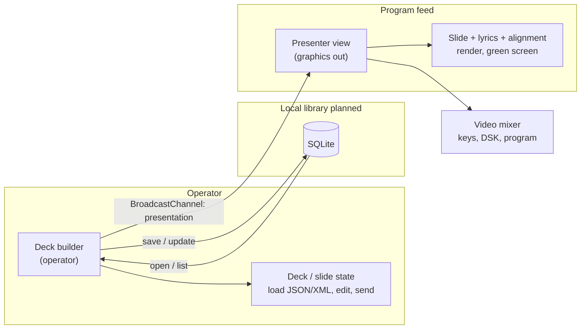

# Poster design guide

**Poster is a browser-based **graphics and slide** system for **professional live video** and **presentation** workflows: a dedicated **operator** surface drives a **clean program feed** in lockstep, with optional **chroma-key** output for **live switched programs**. The presenter view is built to sit in the **signal chain** ahead of a **production switcher** or **software mixer**, so slides read as **supers, lower thirds, full-screen graphics, and other overlays** on air—not only as venue projection.**

---

## Vision

Poster separates **control** from **program output**. One operator advances **slides**, **lyrics**, and **messages** from the deck builder while **talent and viewers** see only the **presenter** route: typography and layout intended for **camera shot composition**, **safe title areas**, and **consistent brand treatment** on **16:9 program**.

In **live production**, that presenter window is usually captured as a **graphics source** (browser input, scan converter, NDI, etc.) into a **video mixer**—hardware or software (e.g. Blackmagic ATEM, Ross, vMix, OBS Studio, Wirecast). The TD **keys**, **crops**, or **layers** that source so **slide content** becomes **titles and overlays** on the **live line cut**. Poster stays **web-first**: no required native client or cloud account for the core **operator ↔ presenter** loop.

---

## Synopsis

Poster is built for **professional slide presentation** in **broadcast and live-event** contexts:

- **Deck builder** — load or edit **decks** (from **files** or, **planned**, a **SQLite** **library**), pick **slides** for program, adjust **deck-level styles**, run **song/lyrics** mode with stepped **verse/line** control, **save** and **export** for next time.
- **Presentation view** — **full-frame** output: current **slide**, **lyrics** segments, optional **green screen** for **linear keying**, and **operator messages** only when explicitly sent. This is the **CG/supers feed** the **mixer** uses alongside **cameras** and **playback**—the same asset can support **in-room projection** when needed.

Sync uses the browser **`BroadcastChannel` API** on a fixed channel (`presentation`), so **operator** and **program** windows stay aligned on the **same origin** without a **middle-tier** slide server.

**Content model:** A **deck** is structured data (JSON): metadata, `useGreenScreen`, **per–slide-type** defaults, and an ordered **slide list**. Each **slide** has a **type** (`general`, `title`, `song`, `image`, `audio`, `video`), titles, optional media, and **`SlideCSS`** (color, type, backgrounds, and **horizontal/vertical alignment**—see **Layout and alignment** below).

**Ingest:** **`.json`** decks; **`.xml`** for **song** content where applicable. **Export** JSON for **version control** and **offline authoring**.

**Local library (planned):** A **SQLite** database will hold **presentations** (**decks**), **lyrics** (**songs** / **`SongData`**), and **binary assets** (**images** and other **slide** media) so operators can **browse**, **reload**, and **revise** past shows without starting from scratch—while still **exporting** portable **JSON** (and **media** bundles where needed) for **backup** and **sharing**. See **Local library (SQLite)** below.

**Lyrics (summary):** **Song** content can be loaded from **XML** or carried in **JSON**; **program** shows **two lines at a time** so **audiences** can **read** and **sing along**. See **Lyrics and congregational sing-along** below.

Implementation **sequences**, **runtime** **workflows**, and **deeper** **rationale** for **technology** **choices** live in **[ADR 0001: Tech stack and runtime workflows](adr/0001-tech-stack-and-runtime-workflows.md)**.

---

## Tech stack

Chosen **technologies** **support** **professional** **graphics** **output**, **shared** **TypeScript** **models**, and a **migration** **path** toward **Remix-first** **delivery** while **legacy** **CRA** **tooling** **remains** **in** **use**.

| Area | Technology | Why it’s here |
| --- | --- | --- |
| **UI** | **React 18** | **Component** model, **ecosystem**, **stable** **rendering** for **program** **output**. |
| **Language** | **TypeScript** | **Shared** **types** for **decks**, **slides**, **`PresentData`**, **`SongData`**. |
| **App framework (target)** | **Remix ~1.19** | **Routing** (`app/` **routes**), future **loaders/actions** for **SQLite** **library**, **SSR** **option**. **`npm run dev`** runs **`remix dev`**. |
| **Legacy build / unit tests** | **Create React App** (`react-scripts` 5) | **`npm run build`** and **`npm test`** (**Jest**, **RTL**) until **Remix** **parity** **consolidates** **tooling**. |
| **HTTP server** | **Express** (`server/index.js`) | **Static** **files** + **Remix** **`createRequestHandler`**; **fallback** **SPA** **if** **Remix** **build** **absent**. |
| **Live operator ↔ program** | **`BroadcastChannel`** (`presentation`) | **Same-origin** **sync** **without** a **slide** **server** for **current** **program** **state**. |
| **E2E** | **Playwright** | **Cross-route** and **broadcast** **behavior** in **real** **browsers**. |
| **Planned persistence** | **SQLite** (TBD **server** vs **WASM**) | **Local** **library** per **Local library (SQLite)**; **not** **implemented** **in** **this** **ADR’s** **acceptance** **scope** **beyond** **decision** **to** **use** **it**. |

**Supporting / toolchain:** **React Router** (via **Remix**), **Vite** + **`@vitejs/plugin-react`** in **tree** for **migration** **scaffolding**, **`isbot`**, **web-vitals** (as **declared** in **`package.json`**).

For **version** **pins**, **consequences**, **trade-offs**, and **Mermaid** **sequence** / **flow** **diagrams** (**load** **file**, **send** **slide**, **lyrics** **step**, **dev** **build**, **future** **SQLite**), use **[ADR 0001](adr/0001-tech-stack-and-runtime-workflows.md)**.

---

## Layout and alignment (slides and overlays)

**Slides and overlay graphics** use **horizontal** and **vertical** alignment so a single **presenter** frame can land content in named **locations** on a **3×3 grid**—e.g. **bottom-middle** and **bottom-left** / **bottom-right** for **lower thirds**, **center-middle** for **title cards** and **centered stingers**, **upper-left** / **upper-right** for **corner bugs** and **identifiers**, and **center-middle** (or full-raster treatments) when the **mixer** uses a **full frame** with **transparent** or **keyed** regions.

|            | **Left**    | **Middle**    | **Right**    |
| ---------- | ----------- | ------------- | ------------ |
| **Top**    | upper-left  | upper-middle  | upper-right  |
| **Center** | center-left | center-middle | center-right |
| **Bottom** | bottom-left | bottom-middle | bottom-right |

**Naming:** Each cell is **`{vertical}-{horizontal}`** — **upper-**, **center-**, or **bottom-** (row) plus **-left**, **-middle**, or **-right** (column). That is the vocabulary used below and when discussing **placement** with **TD**s and **operators**.

- **Horizontal** axis (**column**): **left**, **middle**, **right** — picks the **-left** / **-middle** / **-right** suffix.
- **Vertical** axis (**row**): **top**, **center**, **bottom** — picks the **upper-** / **center-** / **bottom-** prefix (row labels **Top** / **Center** / **Bottom** map to those prefixes).

**Examples in production:**

- **bottom-middle** — typical **lower-third** anchor; **bottom-left** / **bottom-right** when graphics hug a **side** under **safe** **title** **area**.
- **center-middle** — **full-title** cards, **stingers**, and **center-cut** supers.
- **upper-left** / **upper-right** — **bugs**, **clock** **slugs**, **identifiers**; **upper-middle** for **top-centered** **banners**.
- **center-left** / **center-right** — **side-aligned** blocks in the **vertical** **middle** (e.g. **interview** **supers**).

*(In **`SlideCSS`**, horizontal alignment is **left / center / right** (this guide’s **middle** column is **center** in the model), and vertical is **top / middle / bottom** (this guide’s **Center** row is **middle** in the model). Combine them mentally to match the table, e.g. **bottom** + **middle** → **bottom-middle**. Keep **presenter** behavior stable so **TD** presets in the **mixer** stay predictable.)*

---

## Lyrics and congregational sing-along

**Purpose:** Support **worship**, **concerts**, and **special events** where **on-screen lyrics** are part of **program**—not only for **talent**, but so the **audience** (in the room and on **stream**) can **see** the **words** and **sing along** with **confidence**. Typography and pacing should match **large-venue screens** and **broadcast supers**: **large**, **high-contrast** type and **steady**, **operator-controlled** advances.

**Sources:**

- **Song XML** — Load **`.xml`** files that describe a **song**: **title**, optional **author**, and **verses** made of **lines** (structured markup the app can parse into **`SongData`**). This covers **dedicated song XML** from **planning** and **presentation** tools; **standard MusicXML** (`.musicxml` / `.xml` from **notation** suites) is the **same family** of **lyric-bearing** interchange—**first-class MusicXML** import (beyond verse/line shapes we already accept) remains a **format** goal where **exports** do not match today’s **schema**.
- **JSON** — Load **`.json`** **decks** that include **`song`** **slides** with embedded **`lyrics`** objects (**title**, **verses**, **lines**) so **set lists** and **graphics** stay in one **file**; the same **model** can support a **standalone song JSON** shape aligned with **`SongData`** as the product matures.

**Two lines at a time:** Lyric **content** is flattened in **order** (verse by verse, line by line). **Program** renders a **segment** of **two consecutive lines** per **step**. The **operator** advances **forward** or **backward** in those **two-line** chunks so the **room** is never flooded with a **full page** of text, while **singers** always have **context** (current line plus **lookahead** or **recent** line depending on **segment** position).

**Operator workflow:** From the **deck builder**, **song mode** sends the **song slide** to the **presenter**, then **Next** / **Previous** (or equivalent) steps **segments**—**two lines** per **advance**. **Partial** **`PresentData`** updates (**lyrics navigation**) move the **segment index** on **program** without **replacing** the whole **slide** payload each time, which keeps **graphics** and **mixer** **keys** **stable** during **live** **song** **flow**.

**Program / audience experience:** The **presenter** route shows the **current** **two lines** centered in the **lyrics** region (with **slide** styling and optional **green screen** for **keyed** **lyrics** over **video**). **Stream** and **venue** **screens** fed from the same **output** give **congregations** and **at-home** viewers a **shared**, **readable** **sing-along** **surface**.

---

## Local library (SQLite)

**Goal:** Give operators a **durable**, **local** **library**—not only **one-off** **file** **uploads**. **Presentations** (**decks**), **lyrics** (**song** records derived from **XML** or stored **`SongData`**), and **images** (and other **raster** assets referenced by **slides**) live in **SQLite** so past work is **listed**, **opened**, **edited**, and **run** again.

**What gets stored (conceptual):**

| Domain                    | Role in SQLite                                                                                                                                                                                                             |
| ------------------------- | -------------------------------------------------------------------------------------------------------------------------------------------------------------------------------------------------------------------------- |
| **Presentations / decks** | **Deck** **metadata**, **slide** **order**, **slide** **payloads** (JSON **blobs** or **normalized** **rows**—**implementation** **TBD**), **timestamps**, optional **tags** / **service** **date**.                       |
| **Lyrics / songs**        | **Reusable** **song** **records** (**title**, **author**, **verses** / **lines**) so the same **hymn** or **chart** can attach to **multiple** **decks** or **set** **lists** without **duplicating** **XML** **imports**. |
| **Images & media**        | **Binary** **blobs** (or **paths** if **server** **filesystem** is used) keyed by **id**, referenced from **slides** (**backgrounds**, **image** **slides**, **thumbnails** for **builder** **UI**).                       |

**Workflows:**

- **Save / update** — **Persist** the **current** **deck** (and **linked** **media** / **songs**) from the **builder**; **update** **existing** **rows** when the operator **saves** **changes** to a **library** **presentation**.
- **Open** — **Pick** a **past** **presentation** from a **library** **list**; **hydrate** the **builder** so **slides**, **lyrics**, and **images** **resolve** from the **db**.
- **Export** — **Emit** **JSON** **decks** (today’s **interchange** **format**) and, when **slides** **reference** **library** **blobs**, optionally **export** a **folder** **bundle** (**JSON** + **assets**) for **Git**, **USB**, or **another** **machine**.
- **Import** — **Existing** **file** **flows** (**JSON** **deck**, **song** **XML**) remain; **imports** can **optionally** **also** **write** into the **library** so **uploads** become **first-class** **records**.

**Placement options (engineering note, not decided here):**

- **Server-side SQLite** (e.g. **Remix** **loaders/actions**, **file** on **disk** next to the **app**) — natural for **multi-tab** **shared** **library** on one **host**, **simple** **backup** of a **single** **`.sqlite`** **file**.
- **Browser-side SQLite** (**WASM** / **OPFS**) — fits **static** **hosting**; **sync** **across** **devices** is **harder**; **export** becomes **even** **more** **important** for **portability**.

**Design alignment:** This **complements** “**files** as **source** of **truth**”: the **library** is the **working** **archive**; **JSON** **export** stays the **portable**, **diffable** **handoff** to **producers** and **version** **control**. **Mandatory** **cloud** remains a **non-goal**; **SQLite** keeps **data** **local** by **default**.

---

## Primary roles and scenarios

| Role                    | Need                                                                                                                                                                   |
| ----------------------- | ---------------------------------------------------------------------------------------------------------------------------------------------------------------------- |
| **Operator / graphics** | Reliable **control surface**, unambiguous **live** state, fast **slide** and **lyrics** steps, optional **on-air** messaging.                                          |
| **Program / audience**  | **Legible** type at **viewing distance** and on **stream**, **stable** layout for **keying**, **correct aspect** (typically **16:9**).                                 |
| **Author / producer**   | **Decks** as **files** (JSON/XML) **and** (planned) a **SQLite** **library** for **reuse**; **repeatable** **show** builds, **templates**, **export** for **archive**. |

**Typical scenarios:** **live switched** **webcasts** with **still images** and **slides** **on program**, **corporate** **keynotes** with **supers**, **house-of-worship** **lyrics** with **camera** **program**, **hybrid** events where **slides** must match **broadcast** **graphics** standards, and **OBS / vMix / ATEM** pipelines capturing the **presenter** window (**chroma** or **luma** **key** where configured).

---

## Architecture (conceptual)

**Runtime** **ordering** (**who** **calls** **what** **when**) is **specified** in **[ADR 0001 — Sequences and workflows](adr/0001-tech-stack-and-runtime-workflows.md#sequences-and-workflows)**; this **section** stays **structural**.

- **Transport today:** same-origin **`BroadcastChannel`** only; no **server-side** **show state** persistence.
- **Payload shape:** **`PresentData`** (slide, message, `useGreenScreen`, optional **`data`** for e.g. **lyrics** navigation).
- **Broadcast path:** **Presenter** is authored for **capture** into a **mixer**; **green screen** and **consistent** **alignment** support **linear** and **chroma** **keys**, **DSKs**, and **multi-layer** **composites** for **professional** **on-air** **graphics**.
- **Persistence (planned):** **SQLite** backs a **local** **library** of **presentations**, **lyrics**, and **images** (see **Local library (SQLite)**); **live** **program** state remains **ephemeral** over **`BroadcastChannel`** unless we add an explicit **sync** story later.

---

## Design principles

1. **Operator vs program** — **Control** UI must not appear on the **presenter** route unless we add an explicit **preview** mode.
2. **Files as source of truth** — **Import/export** **decks** (JSON/XML) as the **portable** **archive**; the planned **SQLite** **library** is the **local** **working** **store**—**export** must remain **first-class** so nothing is **locked** in a **db** operators cannot **extract**.
3. **Offline-capable core** — After load, **builder ↔ presenter** sync does not require **network**.
4. **Predictable program rendering** — **Presenter** output must be **stable** and **readable**—especially when **keyed** or **cropped** in a **video mixer** as **titles** and **overlays**.
5. **Explicit operator messages** — **Supers** and **announcements** go **on program** only when **sent**, not from incidental **UI** state.
6. **Two routes, one product** — **`/deck`** (or equivalent) and **`/presentation`** share **types** and **broadcast** helpers but serve **different** **production** roles.
7. **Alignment is a first-class contract** — **Grid** **locations** (prefixes **upper-**, **center-**, **bottom-** with suffixes **-left**, **-middle**, **-right**) must stay **consistent** with **live video** expectations (**safe areas**, **bottom-row** **lower thirds**, **center-middle** **titles**, **full frame**).

---

## Non-goals (for now)

- Replacing **full** **motion-graphics** suites or **PowerPoint**-style **animation** **timelines** for every **use case**.
- **Multi-operator** **conflict** resolution over **WAN** (no **CRDT** / **server** **authority** yet).
- **Mandatory** **cloud** **accounts**, **analytics**, or **collaboration** **services** for **v1** **workflows**.

---

## Ideation backlog (prioritize together)

Nothing below is committed.

### Product and UX

- **Broadcast-safe layouts:** **Title-safe** and **action-safe** margins for **16:9**, **overlay-only** vs **full-raster** modes, **recommended** **output** **resolution** for **TD** **documentation**.
- **Presenter modes:** **Fullscreen** API, **keyboard** **shortcuts** for **operator**, optional **timer** or **next-slide** **preview** on **builder** only.
- **Transitions:** **Minimal** by default (cut or **subtle** **dissolve**); avoid **busy** **defaults** on **program**.
- **Themes:** **Named** **theme** **presets** (JSON) beyond **raw** **per-deck** **CSS** fields.
- **Accessibility:** **Builder** **focus** order, **high-contrast** **program** theme, **caption** path for **video** **slides**.

### Content and format

- **SQLite schema** **migrations** for **decks**, **songs**, **assets**; **backup** / **restore** of **`.sqlite`** **files**.
- **Deck schema versioning** and **migration** notes when **`Deck`** / **`Slide`** evolve.
- **JSON import validation** with **clear** **operator-facing** errors.
- **Media:** **Local** vs **hosted** **assets**, optional **manifest** for **large** **shows**; **deduplication** of **image** **blobs** by **hash** in the **library**.

### Sync and deployment

- **Optional** **WebSocket** / **server** for **cross-device** or **cross-origin** **present** (large **lift**; **trust** model changes).
- **Remix-first** **dev/build**; **retire** or **isolate** **CRA** when **parity** is **proven**.
- **iframe** / **embed** policy if **decks** are **hosted** **elsewhere**.

### Lyrics

- **MusicXML** and other **notation** **exports** — robust **import** when **lyrics** live in **scores** but **verse/line** mapping differs from today’s **song XML**.
- **Standalone song JSON** — same **`SongData`** shape as **deck**-embedded **lyrics**, **importable** without a full **deck** wrapper.
- **Configurable lines per step** — e.g. **one** or **three** **lines** per **advance** for **different** **genres** or **readability** tests.
- **Chord** or **stage-direction** **markup** on **import** where **formats** allow (optional **display** vs **strip**).
- **Bilingual** or **parallel** **translation** **lines**.
- **Remote** **control** (e.g. **phone**) with **pairing** / **local** **network** **design**.

### Quality

- **Visual regression** for **presenter** **layouts** and the **3×3** **location** **grid** (all **upper-**, **center-**, **bottom-** **cells**).
- **Contract tests** for **`PresentData`** and **broadcast** **events**.

---

## Document maintenance

When **behavior** or **architecture** changes materially, update **Synopsis**, **Tech stack**, **Layout and alignment**, **Local library (SQLite)**, or **Architecture** in the same change. When **dependencies**, **build** **pipelines**, **sync** **mechanisms**, or **step-by-step** **runtime** **flows** change, update or **supersede** **[ADR 0001](adr/0001-tech-stack-and-runtime-workflows.md)** (add a **new** **ADR** **or** **change** **log** **entry** **there**). Treat the **ideation** list as a **parking lot**: **promote** items to **issues** when **scoped**, **prune** when **obsolete**.
