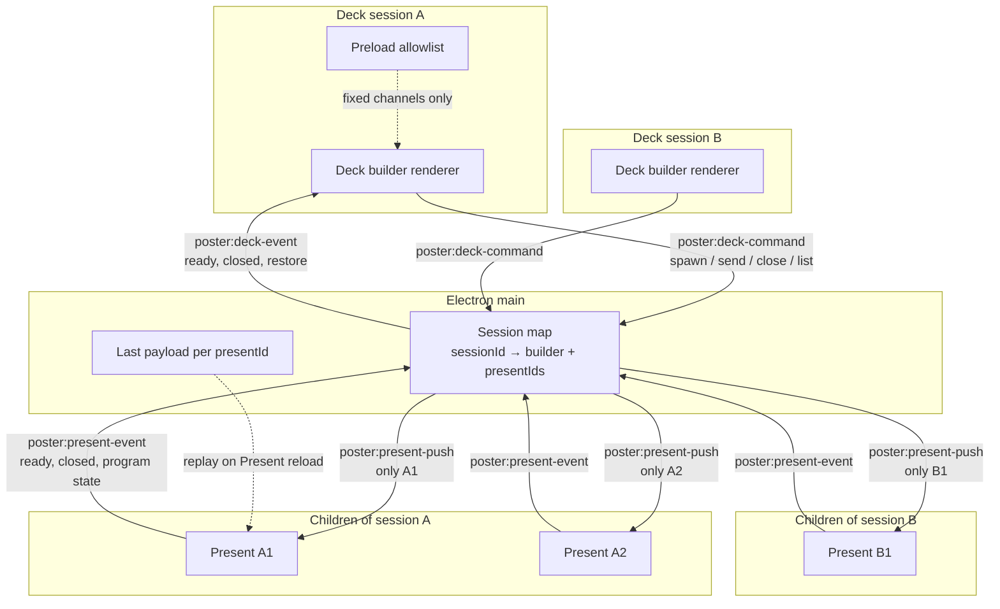

# Multi-deck directed Present, single Home, theme persist, program thumbnail

## Goal

Poster can run multiple deck builders, each with its own Present children, and a send from a deck is posted only to the intended child Window. There is one Home/Library. Theme choice survives restart and Home reopen on every window. Each deck shows a thumbnail of what is on program.

## Current Baseline

Today Present uses a shared BroadcastChannel / handleSendClick / PresentData path, so every listener on that name hears every send. Home Open Presentation already opens a deck builder in a new window while Home stays. Theme selection is not remembered across app open or Home close/reopen.

## Implementation Plan

Main process owns the session graph. Deck renderer never talks to Present renderer.

Four fixed channel names (not per-window strings):

- `poster:deck-command` (deck to main): spawn, send, close, list
- `poster:present-push` (main to one Present only)
- `poster:present-event` (Present to main): ready, closed
- `poster:deck-event` (main to that deck): restore, child closed

Each deck session and each Present gets a UUID from Main. New window, new presentId. Send names target presentIds, or explicit all for children of this session only. Missing targets send to nobody. Guessing another session's id is a no-op. Main caches last payload per presentId and replays it on Present ready/reload.

Present is a logical child in main, not `BrowserWindow({ parent })`.

Home/Library is the window with the list of saved presentations/decks. It is the only main window. If someone tries to open Home again, the original Home gets focus. Present windows are the ones slides are played to.

Selected theme, including the dropdown, is restored the next time the app is opened and when the main window is closed and reopened. That theme applies to Home, deck builders, and Present windows.

The deck shows a thumbnail of what is on program. That thumbnail must not go back onto a shared slide bus; it uses the same directed path (for example Present reports state to Main, Main forwards only to the owning deck).

### Functional requirements

- REQ-001 Directed send: Multiple deck builders, each with one or more Present children. Each Present belongs to one deck. Posts go only to the chosen child Window. Send to a named child, or to all children of that deck only. Other decks never receive it. Missing target sends to nobody. Kill the shared BroadcastChannel / handleSendClick / PresentData path for slide payloads. Main owns the session graph. Four fixed channels. Logical child, not Electron parent. New Present window gets a new id. Main caches last payload and replays it if that Present reloads.
- REQ-002 Single Home: Home/Library is the one main window, the list of saved presentations/decks. Only one Home. Opening Home again focuses the existing one. Present windows are where slides play. Open Presentation opens a deck window; Home stays put.
- REQ-003 Theme persist: Remember the selected theme, including the dropdown, on app restart and when the main window is closed and opened again. Apply that theme to Home, deck builders, and Present windows.
- REQ-004 Program thumbnail: In the deck, a thumbnail of what is on program.

## Data Flow

## Primary Files Expected to Change

Electron main process window/session graph, Present send path (today BroadcastChannel / handleSendClick / PresentData), Home window open/focus, theme persistence and dropdown, deck program thumbnail UI.

## Validation

- [ ] Deck A send-to-A1 does not show on A2 or any B Present.
- [ ] Deck A send-to-all-its-children does not show on B.
- [ ] Deck B cannot drive A's children (including by guessing an id).
- [ ] Closing a Present drops it from that deck's list. Reopen gets a new presentId.
- [ ] Reloading a Present still shows the last payload Main cached for it.
- [ ] Only one Home/Library exists. Opening Home again focuses the original Home. Home is the saved-deck list. Present windows play slides. Open Presentation leaves Home in place and opens a deck window.
- [ ] After choosing a theme (dropdown shows it), quit and reopen the app: the same theme is applied on Home, decks, and Presents, and the dropdown still shows that choice.
- [ ] Close the main Home window and open it again: same theme restore as above.
- [ ] A deck shows a thumbnail of what is on program.
- [ ] Slide payloads are not sent on BroadcastChannel.

## Out of scope (unless explicitly added later)

- Using BroadcastChannel with a filter so children receive every send and ignore some
- `BrowserWindow({ parent })` for Present windows
- Allowing a second Home/Library window to exist (focus the original instead)

## Risks to manage

- Fullscreen Present on a second display fights OS parent-child window stacking (keep ownership logical in main).
- Thumbnail of program must not reintroduce a global bus.
