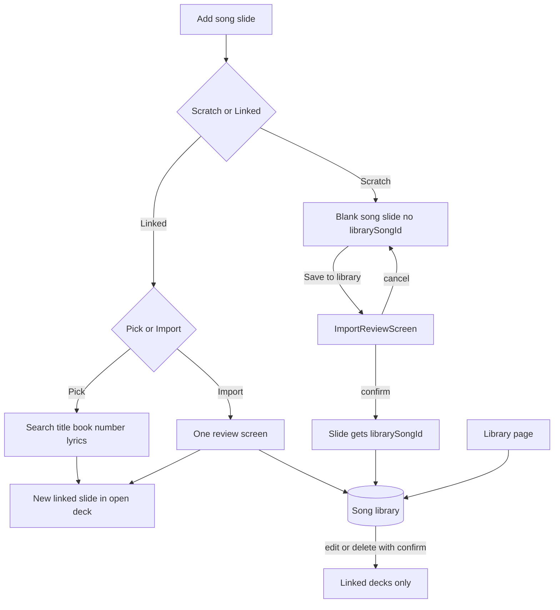

# Epic 004: Song library

## Goal

Poster has a local song library that starts empty. Users add songs by hand or import files through one review screen, find songs by title, book, number, or lyrics, and add a linked song slide to the open deck. Editing or deleting a library song can update the decks that use it after the user confirms.

## Current Baseline

- Song slides and Present two-line staging already exist.
- Importing a song XML or song-shaped JSON today replaces the whole deck.
- A `songs` table exists in the local Poster database but is unused.
- Doug's gathered books live as import files only; they must not ship inside the app.

## Implementation Plan

1. Persist library songs with stable ids; ship empty.
2. Build the import review screen and parsers for gathered JSON plus existing song XML/JSON.
3. Build Add song slide chooser, library picker, and library page.
4. Store a library song id on slides added from the library; wire edit/delete update prompts.
5. Keep Present staging unchanged.
6. Cover AC-001–AC-018 with automated tests.

### Out of scope

- Bundling the three church books in the app
- Transcribing the five copyright-held songs
- Changing how Present stages a song slide
- Replacing the open deck with an imported song

## Data Flow

```mermaid
flowchart TD
  addSlide[Add song slide] --> kind{Scratch or Linked}
  kind -->|Scratch| blank[Blank song slide no librarySongId]
  blank -->|Save to library| saveReview[ImportReviewScreen]
  saveReview -->|confirm| linkedFromScratch[Slide gets librarySongId]
  saveReview -->|cancel| blank
  kind -->|Linked| choice{Pick or Import}
  choice -->|Pick| search[Search title book number lyrics]
  search --> slide[New linked slide in open deck]
  choice -->|Import| review[One review screen]
  review --> slide
  review --> library[(Song library)]
  linkedFromScratch --> library
  manage[Library page] --> library
  library -->|edit or delete with confirm| decks[Linked decks only]
```

## Primary Files Expected to Change

- Local DB / songs persistence and any migration from schema version 1
- Deck builder add-slide and song import paths (`DeckBuilder`, song parser)
- New library UI (picker, review screen, manage page)
- Slide / song types so a slide can hold a library song id
- Present path only as needed to keep existing staging green

## Validation

- [x] Fresh install has zero library songs (AC-001 / REQ-001)
- [x] Hand-added song is findable later (AC-002 / REQ-002)
- [x] Import accepts gathered book JSON and existing Poster song XML/JSON (AC-003 / REQ-003)
- [x] Multi-song file does not import until the review checklist is confirmed (AC-004 / REQ-004, 022)
- [x] No-lyrics songs offer title only or skip; nothing auto-imports (AC-005, AC-015 / REQ-005, 018)
- [x] Title match shows number and lyrics; default keep both; also replace and skip (AC-006, AC-015 / REQ-006, 019)
- [x] Add song slide can import or insert without replacing other slides (AC-007 / REQ-007, 008)
- [x] Search by title, book, number, and lyrics works; shared titles can show first verse (AC-008, AC-012, AC-016 / REQ-009, 014, 020)
- [x] Also save to my library starts checked and only saves when checked (AC-009, AC-014 / REQ-010, 017)
- [x] Edit/delete available; decks update only after confirm; hand-edited slides need an extra yes (AC-010, AC-013, AC-018 / REQ-011, 012, 015, 016, 023)
- [x] Present still title then two lines (AC-011 / REQ-013)
- [x] Library opens from main menu and Add song slide (AC-017 / REQ-021)
- [x] Add slide > SONG offers scratch (blank, unlinked) and linked (chooser); scratch Save to library via ImportReviewScreen; scratch excluded from update prompts until linked (AC-019 / REQ-024)

## Risks to manage

- Same title must not force overwrite; keep both is the default.
- Do not fill empty copyright songs by scanning or transcription.
- Existing decks without library links must keep working; only newly linked slides participate in updates.
