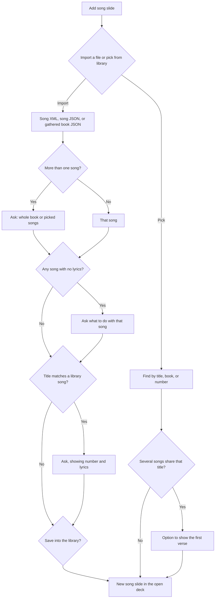

# Poster song library

## Metadata
- **Artifact ID:** 20261004-001
- **Project Name:** Poster
- **Type:** Feature Brief
- **Version:** v1.2
- **Status:** Approved
- **Owner:** Roy Wong
- **Date:** 2026-10-04
- **Source Material:** Requirements interview, 2026-10-04. Doug's hymn inventory at /workspace/hymn-scrape/output/. Poster song-slide and unused songs table on main.

## Summary
Poster keeps a local song library that starts empty. Songs are added by hand or by importing files, then picked onto a song slide in the deck being edited. The library is not bundled with the three gathered church books.

## Business Context
Song slides today only exist inside a deck, or as a file import that replaces the whole deck. A reusable library lets a gathered song be found and added again without retyping it.

## Requirements
- REQ-001: Poster ships with an empty song library. The three gathered books are not bundled.
- REQ-002: A song can be added one at a time in the app.
- REQ-003: A song can be imported from Doug's gathered JSON and from the song XML and JSON files Poster already accepts.
- REQ-004: When a file contains many songs, Poster asks whether to import the whole book or only the songs the user picks.
- REQ-005: When a song in an import has no lyrics, Poster asks what to do with that song.
- REQ-006: When an import's title matches a song already in the library, Poster asks what to do, and the prompt shows the song number and the lyrics so different songs that share a title can be told apart.
- REQ-007: Adding a song slide offers two choices: import a song file, or pick a song from the library.
- REQ-008: Picking a library song adds it as a new slide in the deck being edited. It does not replace that deck.
- REQ-009: Library songs can be found by title, book, or number.
- REQ-010: Importing a song while adding a slide asks whether to save that song into the library.
- REQ-011: A song already in the library can be edited and deleted.
- REQ-012: Editing or deleting a library song asks whether to update decks that already use it.
- REQ-013: Presenting a song slide keeps the current behavior: a title, then two lyric lines at a time.
- REQ-014: When picking a library song for a slide, if more than one result shares the same title, Poster offers a way to show the first verse of each so the right song can be chosen.
- REQ-015: A song slide added from the library stays linked to that library song.
- REQ-016: When a library update would change a linked slide that was edited by hand in a deck, Poster asks before overwriting it.
- REQ-017: Importing a song while adding a slide shows an "Also save to my library" checkbox, checked by default, on the same screen.
- REQ-018: Songs with no lyrics can be imported as title only, or skipped.
- REQ-019: A title match offers keep both (default), replace, or skip.
- REQ-020: Library search matches title, book, number, and lyrics.
- REQ-021: The library page is reachable from the main menu and from Add song slide.
- REQ-022: Import uses one review screen per file: a song checklist with all songs checked, and sections for no-lyrics songs and title matches shown only when they apply. A single song file with no problems skips the review screen.
- REQ-023: After an edit or delete, Poster asks about updating decks only when the song is used in a deck, and lists those decks to choose from.

## Acceptance Criteria
- AC-001 (REQ-001): A fresh install has no songs in the library.
- AC-002 (REQ-002): A song entered by hand appears in the library and can be found later.
- AC-003 (REQ-003): Import accepts a gathered book JSON file and an existing Poster song XML or song JSON file.
- AC-004 (REQ-004): Opening a multi-song file does not import anything until the user chooses the whole book or a subset.
- AC-005 (REQ-005): A song with empty verses is not imported or skipped until the user answers the prompt.
- AC-006 (REQ-006): Two songs with the same title and different numbers or lyrics can both exist in the library. A title match shows number and lyrics before anything is overwritten.
- AC-007 (REQ-007, REQ-008): From an open deck, adding a song slide can import a file or insert one library song as a new slide, and the other slides stay.
- AC-008 (REQ-009): Search by title, by book, and by number each returns the matching songs.
- AC-009 (REQ-010): Saving an imported song into the library happens only after the user says yes.
- AC-010 (REQ-011, REQ-012): Edit and delete are available. Decks that already contain the song change only after the user says to update them.
- AC-011 (REQ-013): Present still shows the title stage, then two lyric lines per stage.
- AC-012 (REQ-014): A search that returns two or more songs with the same title can show the first verse of each before one is added to the deck.
- AC-013 (REQ-015, REQ-016): Editing a library song can update linked slides. Slides edited by hand are not overwritten without a yes.
- AC-014 (REQ-017): The save checkbox is checked by default and saving follows the box.
- AC-015 (REQ-018, REQ-019): No-lyrics songs can come in as title only. Title matches default to keep both and also offer replace and skip.
- AC-016 (REQ-020): Searching a lyric phrase finds the song.
- AC-017 (REQ-021): The library opens from the main menu and from Add song slide.
- AC-018 (REQ-022, REQ-023): A clean multi-song file imports in one click. Problem sections appear only when needed. Unused songs edit or delete without a deck prompt.

## Diagrams
How a song gets onto a slide.

Picking or importing adds a slide to the deck already open. A title match is a prompt, not an automatic overwrite.

## Scope
### In scope
- Empty local song library
- Add one song by hand
- Import existing Poster song files and Doug's gathered JSON
- Prompts for multi-song files, songs with no lyrics, title matches, saving an import, and updating decks after an edit or delete
- Search by title, book, or number, with the first verse available when several songs share a title
- Add a library song as a new slide in the open deck

### Out of scope
- Bundling the three church books in the app
- Transcribing the five copyright-held songs
- Changing how Present stages a song slide
- Replacing the open deck with a song

## Constraints
- The five songs with no lyrics stay untranscribed. Their notes say copies are not allowed. Import may only ask what to do with an empty song. It must not be filled by scanning or copying those pages.
- Song text already on a slide stays there unless the user agrees to update decks after a library edit or delete.
- Same title is not enough to treat two songs as the same song.

## Dependencies
- Existing song slide type, song file import, and Present two-line staging
- Unused local songs table in the Poster library database
- Doug's gathered JSON, if the user chooses to import it: hymns, Hymns for Home and Church, and the Children's Songbook. 686 of 691 have lyrics.

## Stakeholders
- Roy Wong, owner
- Doug, gathered the song files

## Open Questions
- None. Approved by Roy on 2026-10-05.

## Source References
- UX review by Pam: /workspace/projects/poster/20261004-song-library-ux-review-pam.md
- Requirements interview in this chat, 2026-10-04, including the same-title first-verse choice when picking a song for a slide
- /workspace/hymn-scrape/output/SUMMARY.md
- Poster main: song slides, song parser, and the unused songs table
