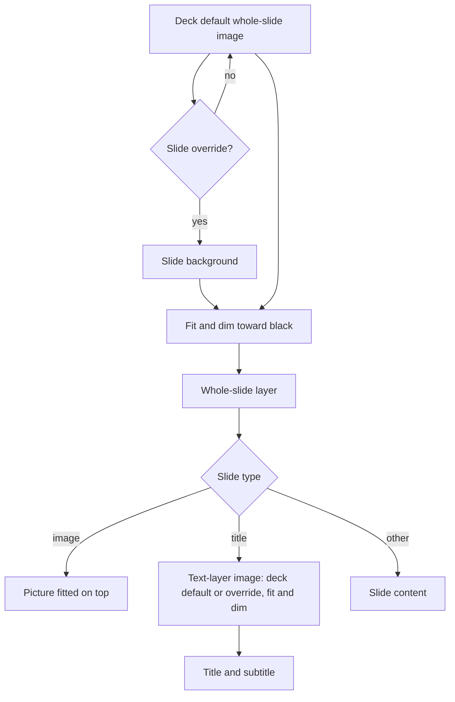

# Epic 005: Background images

## Goal

Every Poster slide can show a whole-slide background image, and title slides can also show a separate image behind their title and subtitle. The deck sets one default for each image, and any slide can override either one. Both images get a fill, fit, or tile choice and a dimming slider. Images come from a local file or a web URL and are copied into the deck.

## Current Baseline

- `src/domain/PresentTypes.tsx`: `SlideCSS` already has `backgroundImage`, `backgroundSize`, `backgroundPosition`, and `backgroundColor`. `Deck.slideStyles` holds styles per slide type, and each `Slide` has its own `style`.
- `Present.tsx` (around lines 301–319): image slides use `slide.file ?? style.backgroundImage`, and other slides use `style.backgroundImage`. Title text sits on a solid `backgroundColor`.
- DeckBuilder: deck default background color around line 1096, and the "Image URL/file" field around line 1315.
- Green screen mode currently changes slide backgrounds.

## Implementation Plan

1. Data model: add deck-level defaults and slide-level overrides for the whole-slide image and the title text-layer image, each with fit and dim. Keep the existing fields readable so older decks load unchanged.
2. Image import: one picker for file or URL that copies the image into the deck's storage. A failed URL download shows an error and leaves the field empty.
3. Deck settings UI for the two defaults.
4. Slide editor UI for overrides, with Use deck default to reset.
5. Rendering in the editor preview and Present, including the image-slide stacking and the title text layer.
6. Green screen keeps both images.
7. Tests.

### Out of scope

- A shared image library across decks.
- Video or animated backgrounds.
- Text-layer images on slide types other than title.
- Separate deck defaults per slide type.

## Data Flow

## Primary Files Expected to Change

- `src/domain/PresentTypes.tsx` (deck and slide background fields)
- `Present.tsx` (rendering)
- DeckBuilder (deck defaults and slide override controls)
- Deck save/load and image storage code
- Green screen handling
- Tests alongside these

## Validation

Definition of Done: all of the following pass.

- AC-001 (REQ-001): A background image can be set on, and is shown in Present for, general, title, song, image, audio, and video slides.
- AC-002 (REQ-002): A title slide shows its text-layer image behind the title and subtitle, separate from the whole-slide background.
- AC-003 (REQ-003, REQ-004): A deck default applies to every slide without an override. An override shows the slide's own image, and Use deck default goes back to the deck image.
- AC-004 (REQ-005): An image slide shows its picture fitted on top with the background visible around it.
- AC-005 (REQ-006): Fill, fit, and tile each render as named, and new images default to fill.
- AC-006 (REQ-007): The dimming slider visibly darkens the image toward black in the editor and in Present.
- AC-007 (REQ-008, REQ-009): A file image and a URL image both still show after the source is deleted, while offline, and after the deck is moved to another computer.
- AC-008 (REQ-008): A URL that fails to download shows an error and leaves the field empty.
- AC-009 (REQ-010): Green screen mode still shows both images.
- AC-010 (REQ-011): A deck saved on the current release opens with the same look.
- AC-011: The deck has a single default for each image, applied across all slide types.
- AC-012: CI passes, and Present song staging and existing title font-size behavior are unchanged.

## Risks to manage

- Embedded images make deck files bigger. Keep the original image bytes and don't duplicate an image that's used on many slides.
- PR #26 changes song slides and DeckBuilder. Start this after #26 merges, rebased on main.
- Text readability over busy images depends on dimming, so check song lyrics and title text at the default dim level.
