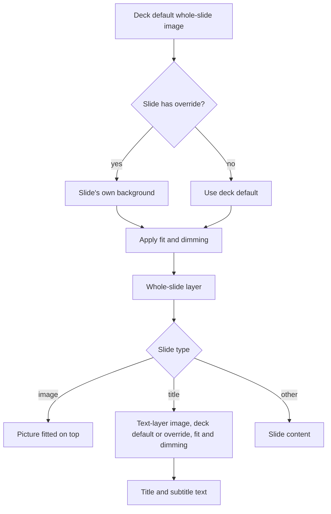

# Poster background images

## Metadata
- **Artifact ID:** 20261008-001
- **Project Name:** Poster
- **Type:** Feature Brief
- **Version:** v1.0
- **Status:** Approved
- **Owner:** Roy Wong
- **Date:** 2026-10-08
- **Source Material:** Requirements interview, 2026-10-08. Poster main: `src/domain/PresentTypes.tsx` (SlideCSS, Deck.slideStyles), `Present.tsx` background rendering, DeckBuilder image and background color fields.

## Summary
Every Poster slide can show a whole-slide background image, and title slides can also show a separate image behind their title and subtitle text. The deck sets a default for each image, and any slide can override either one. Both images get a fill, fit, or tile choice and a dimming slider.

## Business Context
Today Poster has one `style.backgroundImage` field, mostly used by image slides, and title text sits on a solid background color. Decks can't carry a consistent themed background, and title text can't sit on artwork.

## Requirements
- REQ-001: Every slide type (general, title, song, image, audio, video) can show a whole-slide background image.
- REQ-002: Title slides can also show a separate image behind the title and subtitle text layers.
- REQ-003: The deck sets a default whole-slide background image and a default title text-layer image.
- REQ-004: Any slide can override the deck's whole-slide background image, and any title slide can override the deck's text-layer image. A slide can also go back to the deck default.
- REQ-005: On image slides, the whole-slide background shows behind the slide's own picture, and the picture is fitted on top.
- REQ-006: Both images have a fit choice of fill, fit, or tile. Fill is the default.
- REQ-007: Both images have a dimming slider so text stays readable.
- REQ-008: An image can be picked from a local file or entered as a web URL.
- REQ-009: Either way, the image is copied into the deck, so the deck still works when it's moved to another computer or opened offline.
- REQ-010: Green screen mode keeps both background images visible.
- REQ-011: Decks saved before this feature still open and look the same.

## Acceptance Criteria
- AC-001 (REQ-001): A background image can be set on, and is shown in Present for, each of general, title, song, image, audio, and video slides.
- AC-002 (REQ-002): A title slide shows its text-layer image behind the title and subtitle, separate from the whole-slide background.
- AC-003 (REQ-003, REQ-004): Setting a deck default applies it to every slide without its own override. A slide with an override shows its own image, and resetting it goes back to the deck default.
- AC-004 (REQ-005): An image slide shows its picture fitted on top, with the background visible in any space around it.
- AC-005 (REQ-006): Fill, fit, and tile each render as named, and new images default to fill.
- AC-006 (REQ-007): Moving the dimming slider visibly darkens or fades the image in the editor and in Present.
- AC-007 (REQ-008, REQ-009): An image from a local file and one from a URL both still show after the original file is deleted or the computer goes offline, and after the deck is moved to another computer.
- AC-008 (REQ-010): In green screen mode, both images are still shown.
- AC-009 (REQ-011): A deck saved on the current release opens with the same look.

## Diagrams

## Scope
### In scope
- Whole-slide background image on every slide type, with deck default and per-slide override.
- Title slide text-layer image, with deck default and per-slide override.
- Fill, fit, or tile, plus dimming, for both images.
- Local file or URL sources, copied into the deck.

### Out of scope
- A shared image library across decks.
- Video or animated backgrounds.
- Text-layer images on slide types other than title.

## Constraints
- Builds on the existing SlideCSS `backgroundImage`, `backgroundSize`, and `backgroundPosition` fields and the deck's `slideStyles`.
- Copying images into decks makes deck files bigger.

## Dependencies
- PR #26 (song library) touches song slides. Build this after #26 merges to avoid conflicts.

## Stakeholders
- Roy Wong, owner and approver.

## Open Questions
None. Resolved 2026-10-08:
- The deck has one default for all slide types (one whole-slide image and one title text-layer image).
- If a URL image fails to download, Poster shows an error and leaves the field empty.
- The dimming slider darkens toward black.

## Source References
- Interview answers, 2026-10-08.
- `src/domain/PresentTypes.tsx`, `Present.tsx` (around lines 301-319), DeckBuilder (around lines 1096 and 1315) on main.
